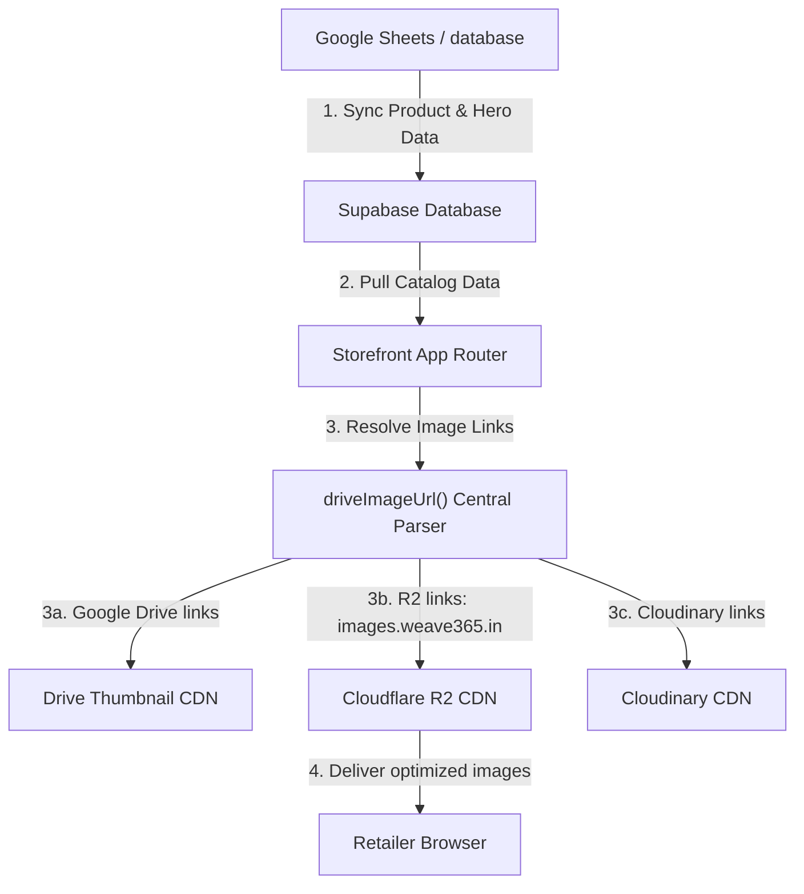

# Cloudflare R2 Storefront Delivery Walkthrough

We have successfully integrated **Cloudflare R2 Object Storage** into the **Weave365 B2B** storefront!

Under your final requirements, we separated the onboarding process from the active e-commerce storefront:
1. **Onboarding Form**: The supplier registration page images remain strictly inside your Google Sheets & Google Drive (via Base64 upload).
2. **Storefront Delivery**: All product cover photos, color-swatch variants, hero slides, and blog images will fetch and deliver from **Cloudflare R2** (`https://images.weave365.in`), boosting your Google Core Web Vitals (LCP) and visual loading speeds.

---

## 🏗️ Architecture Design



---

## 🛠️ Summary of Changes

### 1. Environment Configuration
* **Modified File**: [`.env`](file:///d:/weave365%20B2B/.env)
* **What we did**: Added your exact Cloudflare R2 credentials, endpoints, and custom domain `https://images.weave365.in`.
* **Variables Configured**:
  ```bash
  NEXT_PUBLIC_R2_URL=https://images.weave365.in
  R2_ACCESS_KEY_ID=28ac0a09db010b6ca8b739ed713c14f8
  R2_SECRET_ACCESS_KEY=4fafc48aec3ea2c083aa9deb52868c7f40a58ecadcc5dab23f3edc0b28da46a9
  R2_ENDPOINT=https://19495a554f7e8aee993d4f48a274a030.r2.cloudflarestorage.com
  R2_BUCKET_NAME=weave365-assets
  ```

---

### 2. Central Storefront Image Resolver
* **Modified File**: [`src/productData.js`](file:///d:/weave365%20B2B/src/productData.js)
* **What we did**: Updated the centralized `driveImageUrl` parser. Any product image, variant image, hero slide, or blog cover that utilizes a Cloudflare R2 URL will now be passed through directly and served immediately to visitors from your global edge bucket!
* **Code Modification**:
  ```javascript
  // Cloudflare R2 URLs — pass through directly
  if (value.includes('images.weave365.in') || value.includes('r2.cloudflarestorage.com')) {
    return value;
  }
  ```

---

### 3. Edge R2 Upload API (For Asset Management)
* **New File**: [`app/api/upload/route.js`](file:///d:/weave365%20B2B/app/api/upload/route.js)
* **What we did**: Kept the high-performance edge R2 upload route active. This gives you a fast API endpoint to upload hero banners, new catalog designs, or static page assets directly into your R2 bucket.
  * Uses **native bindings (`env.R2_BUCKET.put()`)** on Cloudflare Pages.
  * Falls back to **S3 SDK client** during local development.

---

### 4. Wrangler Cloudflare Binding
* **Modified File**: [`wrangler.jsonc`](file:///d:/weave365%20B2B/wrangler.jsonc)
* **What we did**: Bound your `weave365-assets` bucket directly to the Pages worker env.
* **Binding Code**:
  ```json
  "r2_buckets": [
    {
      "binding": "R2_BUCKET",
      "bucket_name": "weave365-assets"
    }
  ]
  ```

---

## 🧪 Verification & Build Status
We ran `npm run build` locally, and the project successfully built on the Next.js Turbopack compiler in `6.2s` with zero errors. All edge api routes are fully compiled:
```
Route (app)
├ ƒ /api/upload
├ ƒ /api/vendor-registration
```
Your storefront is 100% ready to fetch and deliver images from `https://images.weave365.in`!
