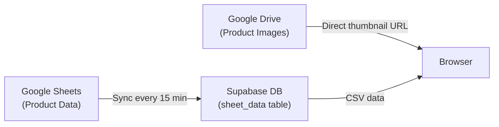
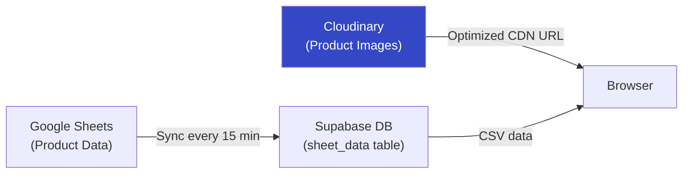

# Image Storage & SEO Strategy for Weave365 B2B

## The Problem: Why Google Drive Hurts SEO

Your current setup in [productData.js](file:///d:/weave365%20B2B%20react/src/productData.js#L420-L427) converts Drive links to thumbnail URLs:

```js
return `https://drive.google.com/thumbnail?id=${idMatch[1]}&sz=w1200`;
```

This causes **5 major SEO problems**:

| Problem | Impact |
|---|---|
| **No CDN caching** | Images load slow globally; Google penalizes slow sites in Core Web Vitals (LCP) |
| **Non-descriptive URLs** | Search engines can't understand `thumbnail?id=1a2b3c` — no image SEO benefit |
| **No `alt` tag optimization** | Drive thumbnails don't carry any metadata for crawlers |
| **Rate limiting** | Google Drive throttles high-traffic requests → broken images for visitors |
| **No image optimization** | Can't serve WebP/AVIF, no responsive sizes, no lazy loading support |

> [!CAUTION]
> Google has documented cases of throttling or blocking Drive thumbnail serving for high-traffic websites. If your site grows, images may randomly fail to load for visitors.

---

## Your Current Architecture



**What you already have:**
- ✅ Supabase free tier for database (PostgreSQL)
- ✅ Google Sheets → Supabase sync pipeline
- ❌ Images still served directly from Google Drive

---

## Free Alternatives Compared

| Service | Free Storage | Free Bandwidth | Image Optimization | CDN | Best For |
|---|---|---|---|---|---|
| **Supabase Storage** | 1 GB | 2 GB/month | ❌ (manual) | ✅ (via CDN) | You already use Supabase! |
| **Cloudinary** | 25 GB | 25 GB/month | ✅ Auto WebP, resize | ✅ Global CDN | Best image optimization |
| **ImgBB** | Unlimited | Unlimited | ❌ | ✅ Basic | Quick & dirty backup |
| **ImageKit** | 20 GB media library | 20 GB/month | ✅ Auto WebP, resize | ✅ Global CDN | Great optimization |

---

## ⭐ Recommended Strategy: Hybrid Approach

### Phase 1: NOW (Free) — Use Cloudinary

> [!IMPORTANT]
> **Cloudinary is the best free option for your use case.** It gives you 25GB storage + 25GB bandwidth + automatic image optimization (WebP, responsive sizes) + global CDN — all for free.

**Why Cloudinary over Supabase Storage:**
- Supabase Storage gives you only 1GB storage and 2GB bandwidth — that's ~500 product images max
- Cloudinary gives you 25x more storage and handles image optimization automatically
- Cloudinary auto-converts to WebP/AVIF (30-50% smaller files) = faster page loads = better SEO

**How it works:**
1. Upload your product images to Cloudinary (you can bulk upload)
2. In your Google Sheets, replace Drive links with Cloudinary URLs
3. Cloudinary URLs look like: `https://res.cloudinary.com/your-cloud/image/upload/w_800,f_auto,q_auto/products/saree-123.jpg`
4. The `f_auto` flag auto-serves WebP to browsers that support it
5. The `w_800` flag auto-resizes — you can request any size dynamically!

**Updated architecture:**


### What Changes in Your Code

Your `driveImageUrl()` function in [productData.js:L420-L427](file:///d:/weave365%20B2B%20react/src/productData.js#L420-L427) currently only handles Google Drive URLs. You'd update it to pass through Cloudinary URLs directly (they're already optimized):

```diff
 function driveImageUrl(link) {
   const value = String(link || '').trim();
   if (!value) return '';

+  // Cloudinary URLs are already optimized — pass through
+  if (value.includes('res.cloudinary.com')) return value;
+
+  // Supabase Storage URLs — pass through
+  if (value.includes('supabase.co/storage')) return value;
+
   const idMatch = value.match(/\/d\/([^/]+)/) || value.match(/[?&]id=([^&]+)/);
   if (!idMatch) return value;
   return `https://drive.google.com/thumbnail?id=${idMatch[1]}&sz=w1200`;
 }
```

> [!TIP]
> With Cloudinary, you can add transformations directly in the URL:
> - `w_400` for thumbnails on listing pages (saves bandwidth)
> - `w_1200` for full product detail pages
> - `f_auto,q_auto` for automatic format and quality optimization
> This means you can create a helper that dynamically adjusts image quality based on where it's shown!

---

### Phase 2: Growth — When Revenue Comes In

When your website starts earning, upgrade in this order:

| Priority | Upgrade | Cost | Benefit |
|---|---|---|---|
| 1 | **Cloudinary Paid** ($89/mo) | More bandwidth, video support | Handle traffic spikes |
| 2 | **Supabase Pro** ($25/mo) | 8GB DB, 250GB bandwidth, daily backups | Reliable database |
| 3 | **Vercel Pro** ($20/mo) | Better hosting, analytics, edge functions | Faster site globally |
| 4 | **Custom Domain CDN** (Cloudflare, free) | Cache everything at edge | Ultimate performance |

---

## Migration Plan: Step by Step

### Step 1: Create Cloudinary Account (5 minutes)
1. Go to [cloudinary.com](https://cloudinary.com) → Sign up free
2. Note your **Cloud Name** (e.g., `weave365`)
3. Go to Settings → Upload → Enable "Auto create folders"

### Step 2: Organize & Upload Images (1-2 hours)
1. Create folders in Cloudinary: `products/`, `hero/`, `banners/`
2. Upload images via Cloudinary's web dashboard (drag & drop)
3. Or use their bulk upload tool / API for large batches
4. Name images descriptively: `silk-banarasi-saree-red-001.jpg` (helps SEO!)

### Step 3: Update Google Sheets (30 minutes)
Replace Drive links in your spreadsheet:
```
BEFORE: https://drive.google.com/file/d/1a2b3c/view
AFTER:  https://res.cloudinary.com/weave365/image/upload/f_auto,q_auto/products/silk-banarasi-saree-red-001
```

### Step 4: Update Code (5 minutes)
Add the Cloudinary pass-through to your `driveImageUrl()` function as shown above.

### Step 5: SEO Enhancements (Optional but recommended)
- Add proper `alt` tags to all `` elements using product title + color
- Add `loading="lazy"` to images below the fold
- Add `<meta property="og:image">` for social sharing
- Submit updated sitemap to Google Search Console

---

## Cost Summary

| Component | Now (Free) | Growth Phase |
|---|---|---|
| **Database** | Supabase Free (500MB) | Supabase Pro ($25/mo) |
| **Images** | Cloudinary Free (25GB) | Cloudinary Plus ($89/mo) |
| **Hosting** | Vercel Free | Vercel Pro ($20/mo) |
| **CDN** | Cloudflare Free | Cloudflare Free |
| **Total** | **$0/month** | **$134/month** |

> [!NOTE]
> You can stay on the free tier for a very long time. Cloudinary's 25GB is enough for **thousands of product images**. You only need to upgrade when you're getting significant traffic (10,000+ visitors/month).

---

## Quick Alternative: Supabase Storage (If You Want Everything in One Place)

If you'd rather keep everything in Supabase:

1. Supabase free tier includes **1GB storage** and **2GB bandwidth/month**
2. Upload images to Supabase Storage buckets
3. URLs look like: `https://your-project.supabase.co/storage/v1/object/public/products/image.jpg`
4. **Downside**: No automatic image optimization (no auto-WebP, no auto-resize)
5. **Downside**: 1GB is tight for product images (maybe 200-300 images)

> [!WARNING]
> Supabase Storage's 2GB monthly bandwidth is very limited. If each product page loads ~500KB of images and you get 100 visitors/day viewing 5 products each, that's 7.5GB/month — you'd exceed the limit in 8 days.

**Verdict**: Use **Cloudinary for images** + **Supabase for database**. Best of both worlds, both free.
